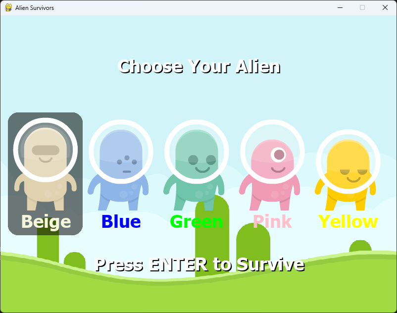
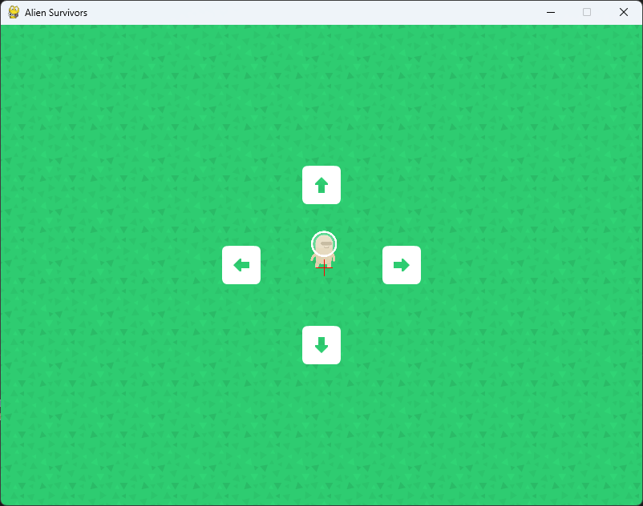

# Alien Survivors

Prosta gra budowana w celach edukacyjnych w PyGame.





## Assety

Wszystkie assety użyte w projekcie pochodzą z [Kenney.nl](https://kenney.nl/)

# Kompilacja

### Wymagane programy i biblioteki
`pip 23.3.2`

`python 3.12`

`pygame 2.5.2`

### Uruchomienie

Aplikację należy uruchomić z pliku `run.py` poleceniem
```
python run.py
```